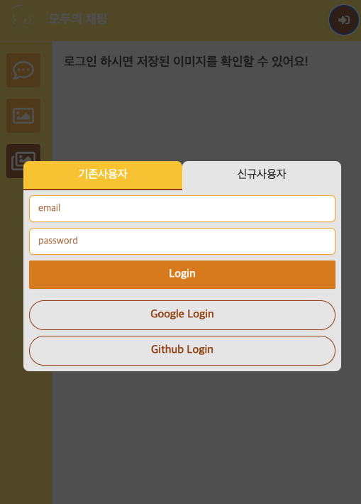
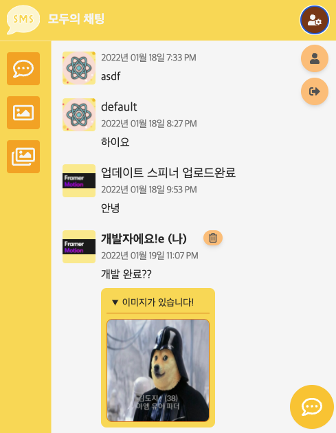
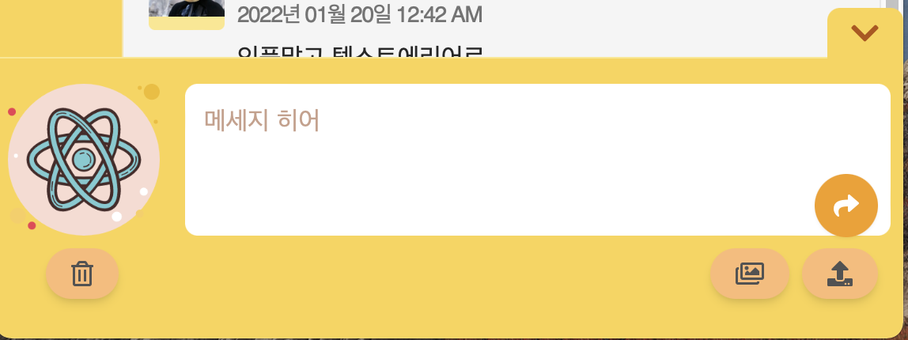
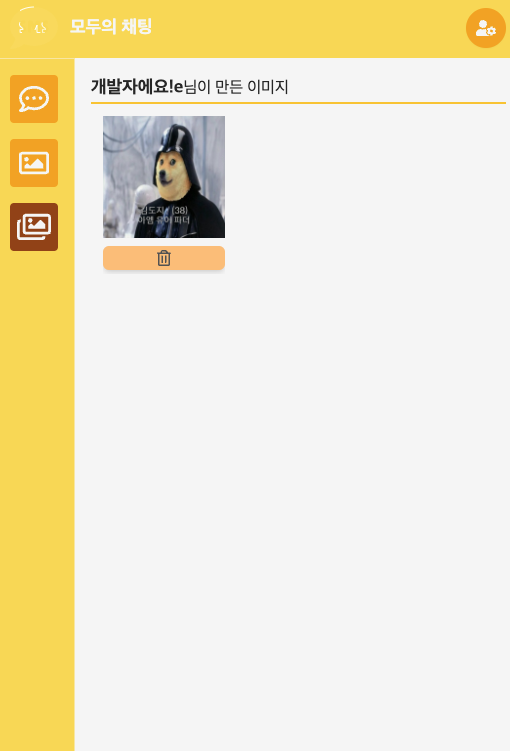

# 모두의 채팅

## 개발 변경사항

- firebase @7.2.0 (~22.01.14) => firebase @9.0.2 변경
  트리쉐이킹 구조로 변경
- Recoil 추가
- tailwind css 추가
- realtime database => fire store로 변경 (추후 query 검색위해)

---

## MVP(Minimum Viable Product)

- [x] 로그인 & 회원가입페이지 (구글, ~~깃허브~~, 자체)
- [x] 채팅 (이미지 + 내용)
- [x] cnavas 짤만들기
- [x] 짤 보관함 / 짤 사용
- [ ] 쿼리 검색 / 데이터가 쌓일 경우
- [ ] tostify 로 ux 개발

---

## 데이터베이스 트리

```ts
/* store */
|
|- chat - (creatAt) // 채팅
|- images - jjal - (userID) // 그림파일
|- user - (userID) // 유저 정보
```

---

## 주요컨셉

- firebase realtime 기반으로 간단한 채팅 구현
- 캔버스 api로 이미지 리사이즈 , 텍스트 및 이미지 조작
- tailwind css로 ui 설계

> storage: 그림파일 <br />
> store: 그외 모든 데이터

---

## 주요기능

### 로그인

- 신규사용자 validation, 기존 사용자 폼
- react-hook-form 으로 validation 후 formstate.error에서 표시함

```ts
<input
  {...register('password', {
    required: '필수항목입니다',
    minLength: {
      value: 8,
      message: '8글자 이상 입력해주세요',
    },
    pattern: {
      value: /^(?=.*[A-Za-z])(?=.*\d)(?=.*[@$!%*#?&])[A-Za-z\d@$!%*#?&]{8,}$/,
      message: '하나의 이상의 문자,숫자,특수문자를 포함해야 합니다',
    },
  })}
  type="password"
  placeholder="password"
/>
```



### 채팅창

- textarea로 줄바꿈도 가능하게 만듬
- sumary details 로 이미지를 접어놓음
- 채팅입력폼은 하단 우측에 팝업형식으로 띄어놓음.
  

### 입력창

- 만들어놓은 사진 사용가능
- file size 1mb 이내로 업로드 가능
- 왼쪽 하단 리셋 버튼으로 클리어
  

### 캔버스

- 캔버스 위에 텍스트로 자막효과 처리
- 로컬에서 img + text 를 그림
- 업로드시 합성이미지를 storage에 저장후 url 리턴 => 다시 store/jjal/userID/uuid 로 업로드
  

### 보관함

- 만든 파일을 삭제 할 수 있음.
- 파일삭제 => storage 삭제 store 삭제
  

---

## 느낀점

[공통]

- 기획없이 이것저것 하니까 개발기간만 길어졌다. 프로토타입을 잘 작성하고 빠르게 기능 단위로 묶어서 개발하는 습관을 **꼭** 가져야 겠다.
- react 재사용성에 대해 다시 생각하는 계기가 되었음. props 로 jsx 컴포넌트를 넘기거나 고차 컴포넌트로 사용성을 올리는 방향에 대해서 꾸준히 공부해야겠음.

[Recoil]

- Redux 대신 비교적 최신에 나온 recoil을 써봄. 러닝커브가 낮은 만큼 쉽게 사용할 수 있었음.
- selected, atom으로 전역관리하니 drilling 을 막을 수 있었음.
- 향후 Redux로 미들웨어를 공부할 계획인데 mobx랑 recoil랑 꼭 비교해봐야겠음.

[firebase]

- 쉽게 구현된 backend로 auth , storage 를 간편하게 구현함
- 데이터 베이스를 찍먹해보았다. noSQL / SQL 차이점을 공부할 수 있었다. **(더 공부해야된다!)**

[tailwind]

- 핫하다는 tailwind css 간편하게 구현할 수 있었음.
- postcss 플러그인과 함께 사용해서 간편했음.
- 컴포넌트 위주의 프로젝트라면 CSS-in-JS(styled components)로 개발하면 편할 것 같고, 소규모 혹은 반응형, 인터렉티브 프로젝트 같은 경우는 CSS-in-CSS 중 tailwind 나 bootstrap 처럼 프레임워크로 개발하면 좋을 것 같다. 프로젝트에 ui-ux 디자이너가 있으면 sass 처럼 변수부터 작성하면 좋을 것 같음
